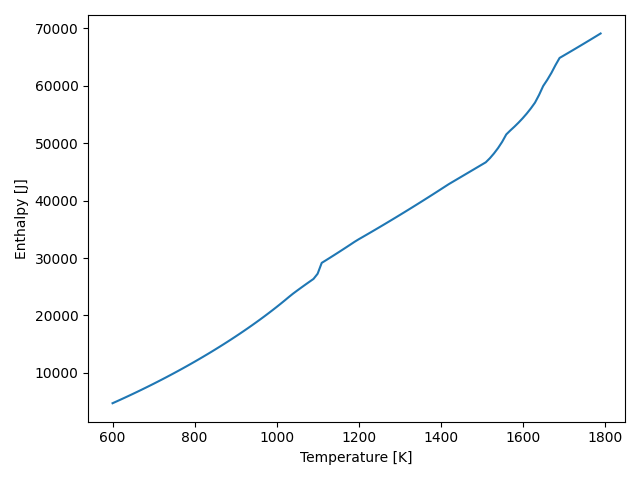
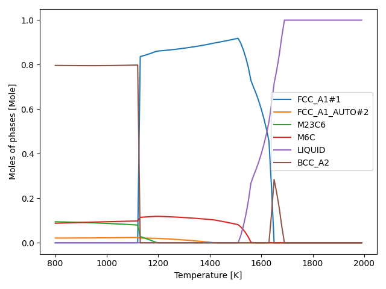
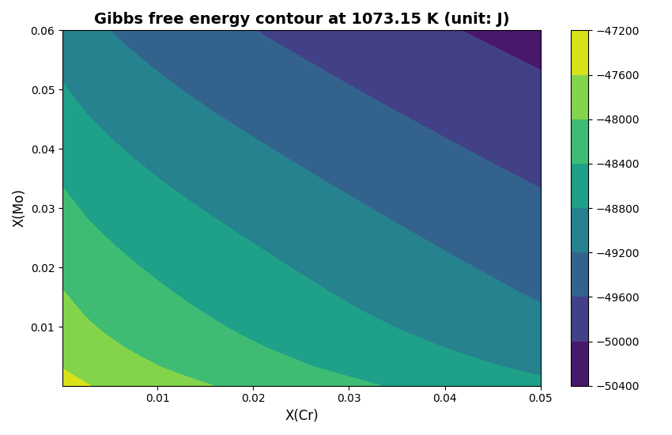
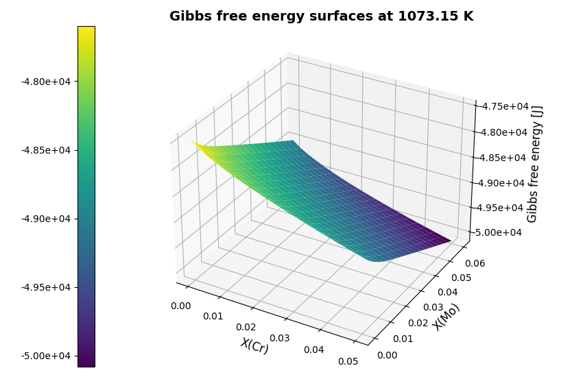
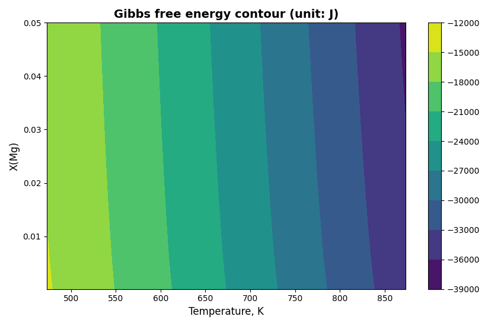
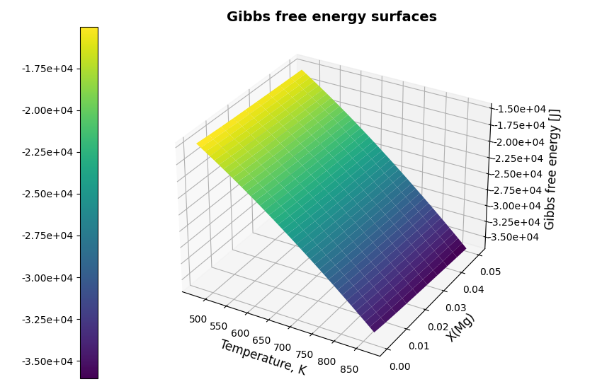
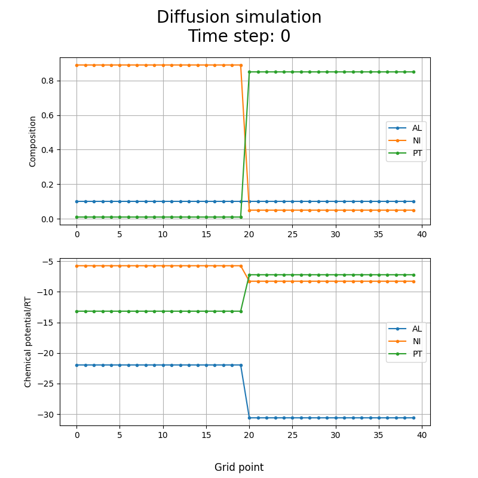
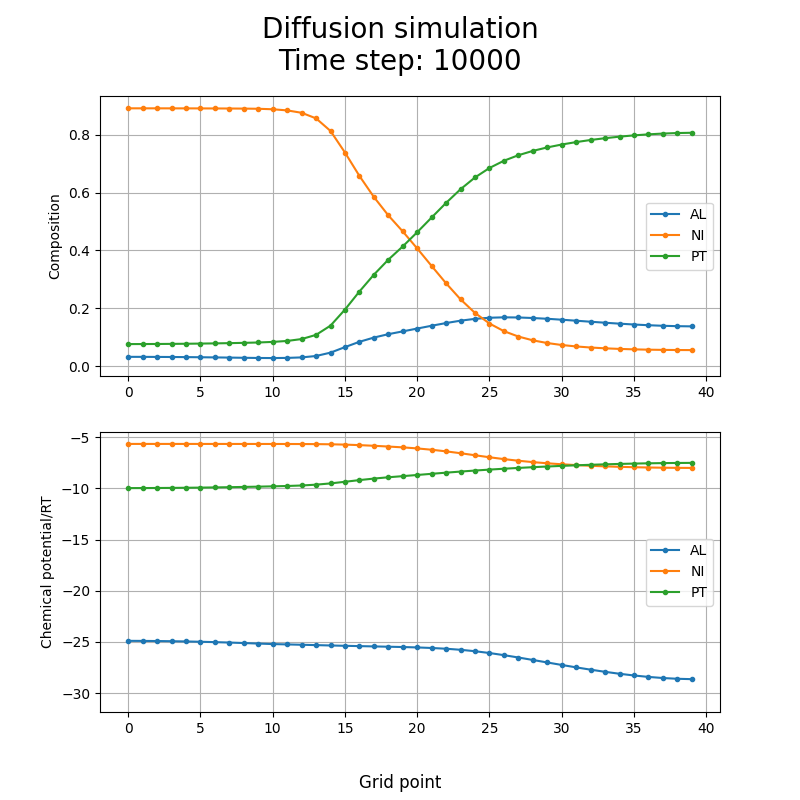

.. _Application examples:

====================
Application examples
====================

These examples are prepared to demonstrate the use of the main features and functions of OC-Python.

Only example 5.1 is related to direct access to subroutines in liboctq modules and other examples uses intermediate module OCPython.py. After equilibrium calculation, one can get more results using the state variables in Table 1 and Table 2.

Direct access to subroutines in wrapped Fortran liboctq module
+++++++++++++++++++++++++++++++++++++++++++++++++++++++++++++++

**Code name** : OC_ex1_direct_access_liboctq.py

This example imports f90wrap_liboctq library and directly access to the subroutines in liboctq modules.

Single equilibrium calculation at temperature 1173 K is done for HSS steel with database steel1.tdb. Some basic subroutines are invoked.

Single equilibrium calculation
+++++++++++++++++++++++++++++++

**Code name** : OC_ex2_singleEq.py

This example shows how to carry out single equilibrium using intermediate module "OCPython.py".

Some features are tested:

1)	Set phase status (suspended, entered)

2)	Calculate equilibrium with or without using grid minimizer

3)	Compare the Gibbs energies with or without using grid minimizer

4)	Get more results (chemical potential, element composition in phases, sites in phases, constituent composition)

Single equilibrium calculation with compact mode
+++++++++++++++++++++++++++++++++++++++++++++++++++

**Code name**: OC_ex3_singleEqCompact_stepCalc.py

This example shows how to use intermediate module for single equilibrium calculation with compact mode and temperature step calculation.

HSS steel is used as an example.

A module "singleEquilibriumCalculation_Compact" inside class "SingleEquilibriumCalculation" is designed to integrate more function, resulting in a compact mode for the serial calculations. The corresponding subroutine "f90wrap_pytqcecompact" in liboctq.f90 is also available, including reading tdb, setting phase status, setting reference phase of element, setting conditions, performing equilibrium calculation. 

   Figure 2 Plot of enthalpy as a function of temperature for HSS steel

Single equilibrium calculation with compact mode plus property diagram 
+++++++++++++++++++++++++++++++++++++++++++++++++++++++++++++++++++++++++++++++

**Code name** : OC_ex4_singleEqCompact_propertyDiagram_HSS.py

This example shows how to create a property (step) diagram for HSS steel.

The step variable is temperature.

A special module is used in OCPython_utility.py to treat the possible new phase (FCC_A1#2) based on FCC_A1 matrix phase.

   Figure 3 Plot of moles of phases as a function of temperature for HSS steel

**Code name** : OC_ex4_singleEqCompact_propertyDiagram_ALCuMgZn.py

This example shows how to create a property (step) diagram for Al-Cu-Mg-Zn alloy.

The step variable is temperature.

.. figure:: images/ex4_AlCUMgZn_propertyDiagram.png
   :width: 520

   Figure 4 Plot of moles of phases as a function of temperature for AlCUMgZn alloy

Batch equilibria calculations with two composition variables
++++++++++++++++++++++++++++++++++++++++++++++++++++++++++++

**Code name** : OC_ex5_batchEq_composition_loop.py

This example shows how to perform batch equilibria calculations and create a contour / 3D diagrams.

Composition step variable is used for batch equlibria computations.

Two composition axes are defined.

**Results plotted for HSS steel:**

   Figure 5 Contour diagram of Gibbs energy vs two composition variations for HSS steel

   Figure 6 3D Plot of Gibbs energy vs two composition variations for HSS steel

Batch equilibria calculations with composition and temperature variables
++++++++++++++++++++++++++++++++++++++++++++++++++++++++++++++++++++++++++

**Code name** : OC_ex6_batchEq_comp_temp_loop.py

This example shows how to perform batch equilibria calculations and create a contour / 3D diagrams.

One step variable is temperature, another step variable is composition.

**Results plotted for Al-Mg-Zn alloy:**

   Figure 7 Contour diagram of Gibbs energy vs two composition variations for Al-Mg-Zn alloy

   Figure 8 3D Plot of Gibbs energy vs two composition variations for Al-Mg-Zn alloy

Simple diffusion model for a ternary Al-Ni-Pt system
++++++++++++++++++++++++++++++++++++++++++++++++++++++++++++++++++++++++++

**Code name** : OC_ex7_diffusion_AlNiPt.py

This example is same as fortran example (https://github.com/sundmanbo/opencalphad/tree/master/examples/TQ4lib/F90/parallel-alnipt).

It simulates diffusion in 1D using OC Ternary system Al-Ni-Pt coating of superallys.

This python code can dynamically illustrate the evolution of compositions and chemical potentials with elapsed time.

**Results plotted at time step 0:**

   Figure 9 Plot of initial composition profile and chemical potential

**Results plotted at time step 10000:**

   Figure 10 Plot of composition profile and chemical potential at 10000 time steps

Single equilibrium calculation plus solidus and liquidus temperature
++++++++++++++++++++++++++++++++++++++++++++++++++++++++++++++++++++

**Code name** : OC_ex8_singleEq_liquidus_solidus_temperature.py

This example shows how to use intermediate module for single equilibrium calculation plus liquidus and solidus temperatures.
To calculate the liquidus and solidus temperatures fixed phase conditions for the liquid phase is utilized.

