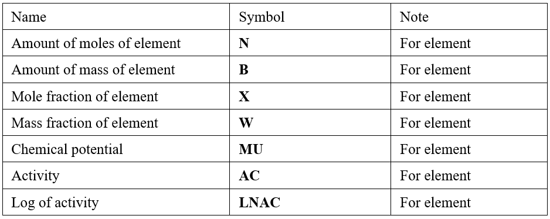
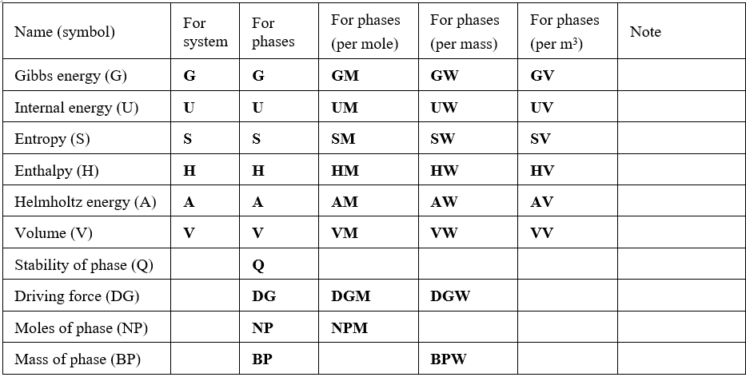

.. _Build and Use:

Build and use of OC-Python
==========================

Build of OC-Python library
+++++++++++++++++++++++++++

*OC-Python library is built with following steps:*

   **1. Building OC TQ**

   Download OC package and run “linkmake” (adding extension ‘.cmd’ first)

   **2. Compile liboctq.f90 using gfortan compiler**

   Create liboctq.mod and liboctq.o

   **3. Wrap f90 files and produce wrappers suitable for input to f2py use**

   **4. Build python library using f2py**

   liboctq_f90wrap.cp37-win_amd64.pyd	for Windows and Python 3.7

   liboctq_f90wrap.cp38-win_amd64.pyd	for Windows and Python 3.8

   liboctq_f90wrap.cp39-win_amd64.pyd	for Windows and Python 3.9

   liboctq_f90wrap.cpython-38-x86_64-linux-gnu.so	for Linux and Python 3.8

   **5. Create a PyPi ready pack**

   ocpython-0.0.1-py37-none-win_amd64.whl for Windows and Python 3.7

   ocpython-0.0.1-py38-none-win_amd64.whl for Windows and Python 3.8

   ocpython-0.0.1-py39-none-win_amd64.whl for Windows and Python 3.9

   ocpython-0.0.1-py38-none-linux_x86_64.whl for Linux (only tested for Ubuntu 20.04)

*Subroutines or functions in the wrapped liboctq.f90:*

 | **minimal:**

   | eq = f90wrap_pytqini(n)
   | f90wrap_pytqrfil(filename,eq)
   | f90wrap_pytqrpfil(filename,nsel,selel,eq)
   | f90wrap_pytqce(target,n1,n2,value,eq)
   | f90wrap_pytqgetv(stavar,n1,n2,n3,values,eq)

 | **useful:**

   | errorcode = f90wrap_pygeterr()
   | f90wrap_pyseterr(errorcode)
   | f90wrap_pytqcecompact(filename,nsel,massunit,selel,tpn,xi,xf,phnames1,elref,phref,eq)
   | f90wrap_pytqcompbatch(nsel,nxfrac,xi,xfrac,temp,stavar,values,eq)
   | f90wrap_pytqtempbatch(nsel,ntemp,xi,xfrac,temp,stavar,values,eq)
   | n,comp = f90wrap_pytqgcom(eq)
   | n = f90wrap_pytqgnp(eq)
   | phasename = f90wrap_pytqgpn(phtupx,eq)
   | phtupx = f90wrap_pytqgpi(phasename,eq)
   | iph,ics = f90wrap_pytqgpi2(phasename,eq)
   | phases = f90wrap_pytqgpsm(n,status1,amdgm,eq)
   | csname = f90wrap_pytqgpcn2(n,c)
   | nspel,smass,qsp = f90wrap_pytqgpcs(c,ielno,stoi)
   | f90wrap_pytqphsts(phtupx,newstat,val,eq)
   | f90wrap_pytqphsts2(phnames,newstat,val,eq)
   | cnum = f90wrap_pytqsetc(stavar,n1,n2,value,eq)
   | f90wrap_pytqtgsw(i)
   | nsub = f90wrap_pytqgphc1(iph,cinsub,spix,yfrac,sites,extra,eq)
   | f90wrap_pytqsphc1(n1,yfra,extra,eq)
   | f90wrap_pytqcph1(n1,n2,n3,gtp,dgdy,d2gdydt,d2gdydp,d2gdy2,eq)
   | f90wrap_pytqcph2(n1,n2,n3,n4,eq)
   | f90wrap_pytqcph3(n1,n2,g,eq)
   | f90wrap_pytqdceq(name)
   | n1,neweq = f90wrap_pytqcceq(name,eq)
   | eq = f90wrap_pytqselceq(name)
   | f90wrap_pytqcref(ciel,phase,tpref,eq)
   | f90wrap_pytqlr(lut,eq)
   | f90wrap_pytqlr1(lut,eq)
   | f90wrap_pytqlc(lut,eq)
   | f90wrap_pytqltdb()
   | f90wrap_pytqquiet(yes)
   | 
   | 
   | 
   | 
   

State variables in Opencalphad
+++++++++++++++++++++++++++++++++++

Thermodynamics variables describe the state of the system at equilibrium. These variables can be divided into two types: intensive variables and extensive variables. Pressure and temperature are two important intensive variables. Please refer to Section 2.6 in Opencalphad's help manual for details. In this user guide (OC-Python), two kinds of tables are given based on the need due to programming. 
 
The state variables in Table 1 are associated with component. All state variables in this table are used for setting condition and getting result.

*Table 1 State variables associated with component*

The state variables in Table 2 are associated with phase.  All state variables in this table are used for getting result and some of them are used for setting condition. 

*Table 2 State variables associated with phase*

Use of OC-Python
++++++++++++++++

You can create a Python script to construct your application using directly the functions listed in the Section 3.1. It is also possible to extend the capabilities of the wrapped Fortran subroutines / functions through generating intermediate Python modules.

Use OC-Python via directly accessing to OC's wrapped subroutines
^^^^^^^^^^^^^^^^^^^^^^^^^^^^^^^^^^^^^^^^^^^^^^^^^^^^^^^^^^^^^^^^^

The user can directly access to OC's subroutines which are defined in liboctq.f90 (https://github.com/sundmanbo/opencalphad/blob/master/examples/TQ4lib/F90/liboctq.F90).
In OC-Python package, these subroutines are re-defined using “f90wrap_py” prefix.

.. table:: *Table 3: Redefinition of subroutine names*
   :align: left

   +-----------------------+-------------+------------------+
   | Code Name             | liboctq.f90 | f90wrap_pytq.f90 |
   +=======================+=============+==================+
   | Subroutine example 1  | tqini       | f90wrap_pytqini  |
   +-----------------------+-------------+------------------+
   | Subroutine example 2  | tqce        | 90wrap_pytqce    |
   +-----------------------+-------------+------------------+

Invoke subroutine “tqini” in TQ fortran code:
	**call tqini(n,ceq)**
Invoke wrapped subroutine “tqini” in Python code:
	oc.f90wrap_pytqini(n)

This kind of invoke is called as low-level use of OC-Python. The user has to know the definitions of input and output for each Fortran subroutine in liboctq.f90. The advantage is that you can program your code freely, which is similar to the programming in OC TQ.

.. table:: *Table 4: Minimal calls of wrapped subroutines in liboctq.f90 for a simple equilibrium calculation*
   :align: left

   +---------------------------+------------------------------------------------------+
   | function                  | Python script                                        |
   +===========================+======================================================+
   | Import library            | from ocpython import liboctq_f90wrap as oc           |
   +---------------------------+------------------------------------------------------+
   | Initiation                | eq = oc.f90wrap_pytqini(n)                           |
   +---------------------------+------------------------------------------------------+
   | Read tdb                  | oc.f90wrap_pytqrpfil(tdbFile,n_elem,element_str,eq)  |
   +---------------------------+------------------------------------------------------+
   | Set temperature condition | oc.f90wrap_pytqsetc('T',0,0,temperature,eq)          |
   +---------------------------+------------------------------------------------------+
   | Set pressure condition    | oc.f90wrap_pytqsetc('P',0,0,pressure,eq)             |
   +---------------------------+------------------------------------------------------+
   | Set molar number          | oc.f90wrap_pytqsetc('N',0,0,pressure,eq)             |
   +---------------------------+------------------------------------------------------+
   | Set composition condition | oc.f90wrap_pytqsetc('X',i+1,0,xcomp,eq)              |
   +---------------------------+------------------------------------------------------+
   | Calculate equilibrium     | oc.f90wrap_pytqce('',gridMinimizerStatus,0,0.0,eq)   |
   +---------------------------+------------------------------------------------------+
   | Get result                | oc.f90wrap_pytqgetv(‘G’,0,0,1,value,self.eq)         |
   +---------------------------+------------------------------------------------------+

Use OC-Python via intermediate Python modules
^^^^^^^^^^^^^^^^^^^^^^^^^^^^^^^^^^^^^^^^^^^^^

The low-level use of wrapped subroutines in OC-Python is not so efficient in programming. A pre-programmed python code, which invokes several low-level subroutines from wrapped Fortran module, can be used instead, leading to a so-called intermediate-level use of wrapped subroutines in OC-Python. For example, "OCPython.py" is a collection of intermediate python codes. It is extensible and users can further add more functions.

Two python scripts are available in the OCPython package:
1) "OCPython.py", is main part of OC-Python
2) "OCPython_utility.py", is the auxiliary part of OC-Python

.. table:: *Table 5: Minimal calls of modules in OCPython.py for a simple equilibrium calculation*
   :align: left

   +---------------------------+--------------------------------------------------------------------+
   | function                  | Python script                                                      |
   +===========================+====================================================================+
   | Import library            | from ocpython.OCPython import SingleEquilibriumCalculation         |
   +---------------------------+--------------------------------------------------------------------+
   | Initiation                | oc = SingleEquilibriumCalculation(vs)                              |
   +---------------------------+--------------------------------------------------------------------+
   | Read tdb                  | oc.readtdb(tdbFile,elements)                                       |
   +---------------------------+--------------------------------------------------------------------+
   | Set temperature condition | oc.setTemperature(temperature)                                     |
   +---------------------------+--------------------------------------------------------------------+
   | Set pressure condition    | oc.setPressure(1E5)                                                |
   +---------------------------+--------------------------------------------------------------------+
   | Set molar number          | oc.setTotalMolarAmount(1)                                          |
   +---------------------------+--------------------------------------------------------------------+
   | Set composition condition | oc.setElementMassFraction(elementMassFractions)                    |
   +---------------------------+--------------------------------------------------------------------+
   | Calculate equilibrium     | oc.calculateEquilibrium(gmStat.On)                                 |
   +---------------------------+--------------------------------------------------------------------+
   | Get result                | oc.getGibbsEnergy()                                                |
   +---------------------------+--------------------------------------------------------------------+

State variables in Tables 1 and 2 can be obtained using functions in OC-Python:

oc.getValuePhase('G'): Gibbs energy values for all phases at the current equilibrium

oc.getScalarResult('G'): Gibbs energy of the system at the current equilibrium

oc.getValueComponent('W'): mass fraction values for all components at the current equilibrium

oc.getValueComponent('MU'): chemical potential values for all components at the current equilibrium

In the next Sections, more examples are shown to demonstrate how build your own application using Python.

Tips for programming
++++++++++++++++++++

To be added later.

**If you have comments and suggestions on OC-Python, please send an email to MatProComp@gmail.com.**

