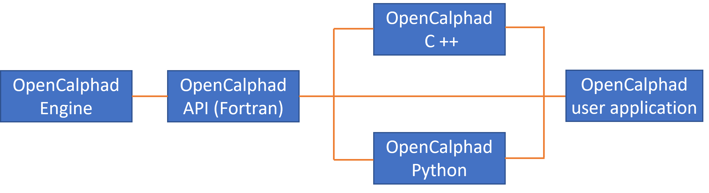

Introduction
============

Open Calphad (OC) is an open-source computational tool of performing thermodynamic calculations for all kinds of applications. OC is written in module structure using modern Fortran (F90) language. It can be operated using two modes: Console and TQ interface.

TQ interface is an application program interface (API) which is developed to FORTRAN and C language users. If you use FORTRAN or C++ , you could find some examples from OpenCalphad GitHub (https://github.com/sundmanbo/opencalphad/tree/master/examples/TQ4lib).

OC-Python is a Python interface, which allows the Python users within the thermodynamical computing field access to OpenCalphad functionality without the requirement of learning Fortran. It is prepared for those who would like to develop own python application codes by coupling OpenCalphad. Of course, it might be a help tool for Integrated Computational Materials Engineering (ICME).

There are some solutions available from GitHub (`Shengyen Li
<https://github.com/dpttw/pyopencalphad/>`_, `Teslos
<https://github.com/Teslos/pyoc/>`_, `Clément Introïni
<https://github.com/sundmanbo/opencalphad/tree/master/OCisoCbinding/>`_) to use OpenCalphad in a Python code.

OC-Python is built by using F2PY and F90wrap tools for the application module “liboctq.f90”. It can be used under Windows / Linux.

F2PY is a tool that provides an easy connection between Python and Fortran languages. F2PY is part of NumPy. F2PY can build the generated extension modules as a library which be imported and used directly in python code.

f90wrap is a tool to automatically generate Python extension modules which interface to Fortran code that makes use of derived types.

Figure 1 show the application structure diagram for Opencalphad. Only subroutines in the TQ library (Opencalphad API) are used to access the Opencalphad Engine (main code), which are invoked by different application programs (Fortran, C++, Python).

   Figure 1 Application structure diagram for Opencalphad

GPL license is used for OC-Python.

